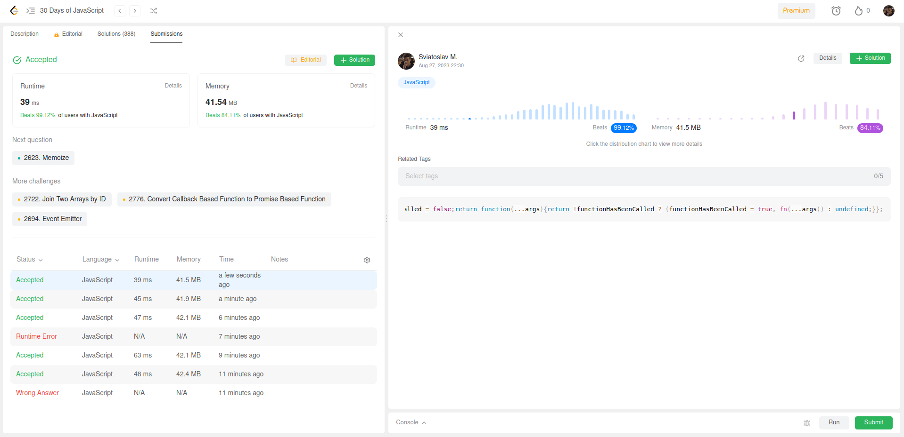

### The problem: https://leetcode.com/problems/allow-one-function-call/description/?envType=study-plan-v2&envId=30-days-of-javascript

Довольно любопытно, насколько быстрым делает исполнение этой программы тернарный оператор, при этом использует столько же памяти.

Это все бред. Как сервер leetcode'a захочет, такую он цифру рантайма и памяти и покажет.